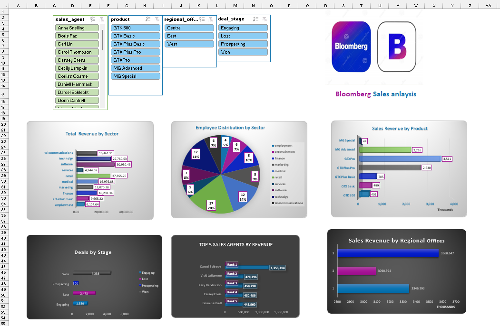

# Sales Performance Dashboard (Excel)

An *interactive sales dashboard* built entirely in *Microsoft Excel* using:
- *Power Query* – for data cleaning and transformation  
- *Power Pivot (Data Model)* – for creating relationships between tables  
- *PivotTables & PivotCharts* – for calculations and visualizations  
- *Slicers* – for interactive filtering  

## 📊 Dashboard Overview

### Key Insights
- *KPIs:* Total Revenue, Total Profit, Number of Accounts, Average Time to Close Deals  
- *Sales by Sector / Product / Regional Office*  
- *Employee Distribution by Sector*  
- *Top 5 Sales Agents by Revenue*  
- *Deals by Stage (Pipeline Analysis)*  

## 🔧 Excel Features Used
- *Power Query:* Loaded and cleaned multiple tables, removed blanks, standardized fields  
- *Power Pivot:* Built a Data Model with relationships for accurate aggregations  
- *PivotTables:* Calculated KPIs and summarized data by multiple dimensions  
- *PivotCharts:* Created bar, column, pie, and line charts  
- *Slicers:* Enabled user-driven filtering (by Agent, Product, Region, Deal Stage)  

## 🖼 Project Steps
### 1️⃣ Data Model (Power Pivot)

### 2️⃣ PivotTables

### 3️⃣ Final Dashboard

## 📂 Files
- [Sales Dashboard (PDF Preview)](Sales%20Dashboard.pdf)  
- Overview.png – Full dashboard screenshot  
- Data model.png – Data model (Power Pivot) view  
- Pivot tables.png – PivotTables used for calculations  

## 🚀 How to Use
1. Download and open Sales_Dashboard.xlsx (if uploaded)
2. Go to *Data → Refresh All*
3. Use slicers to interact with the dashboard  

## 🧾 Notes
- Sample/anonymized dataset used for educational and portfolio purposes.  
- Author: *Ahmed Ghonem*  
  [Xing](https://www.xing.com/profile/Ahmed_Ghonem096187) 
